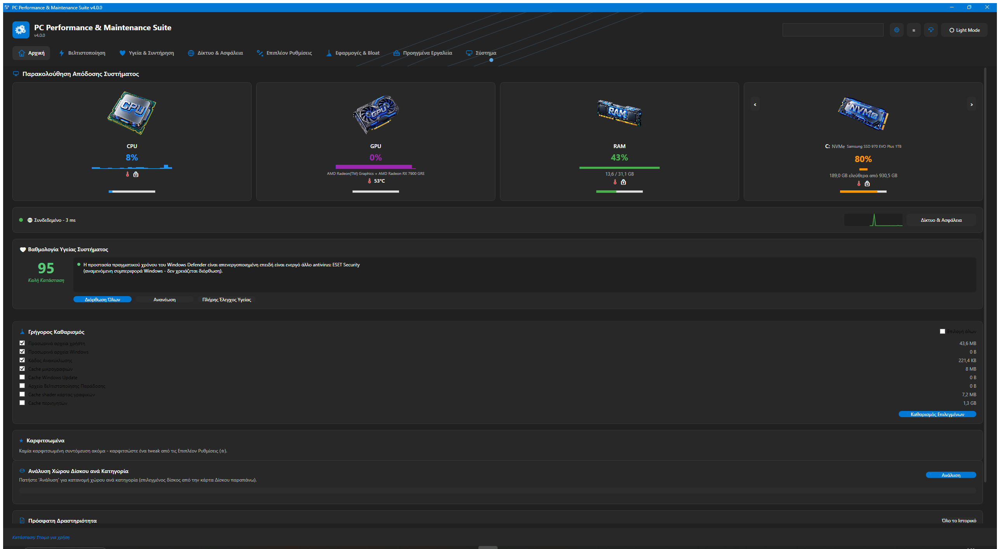
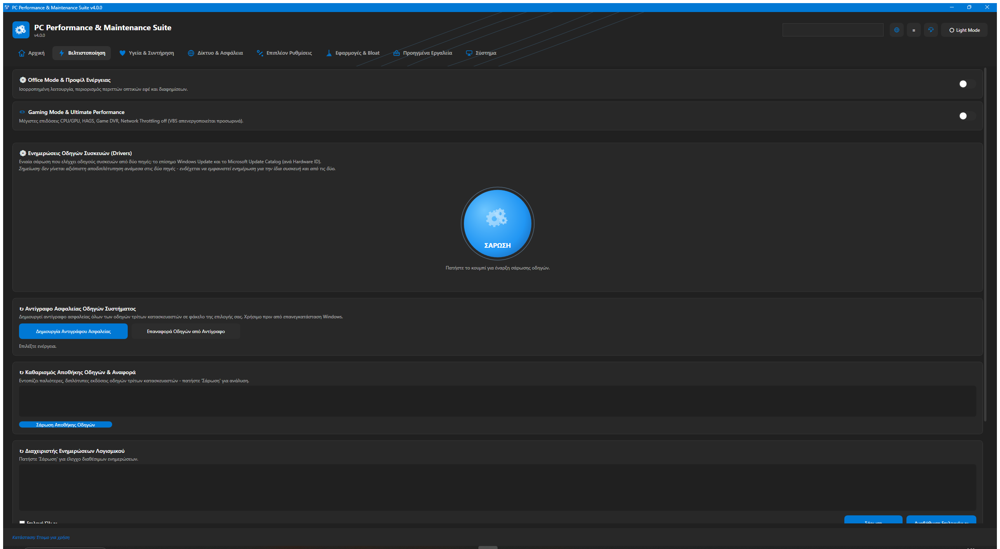
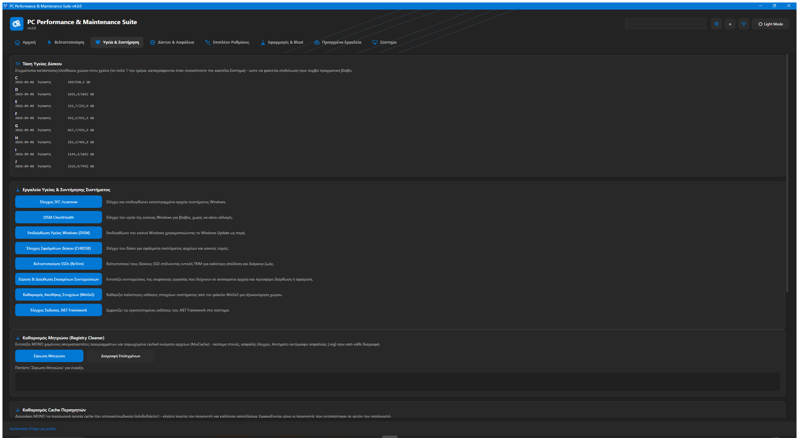
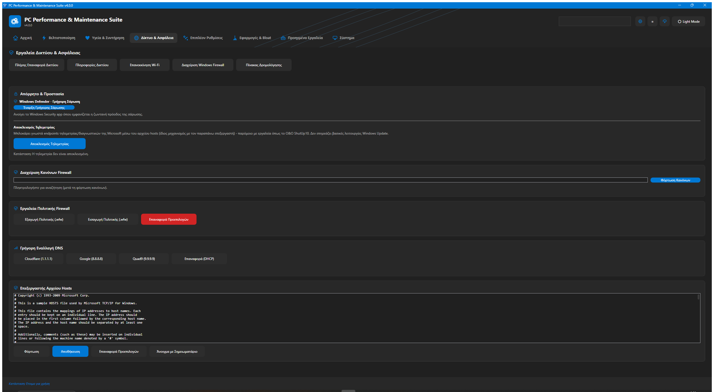
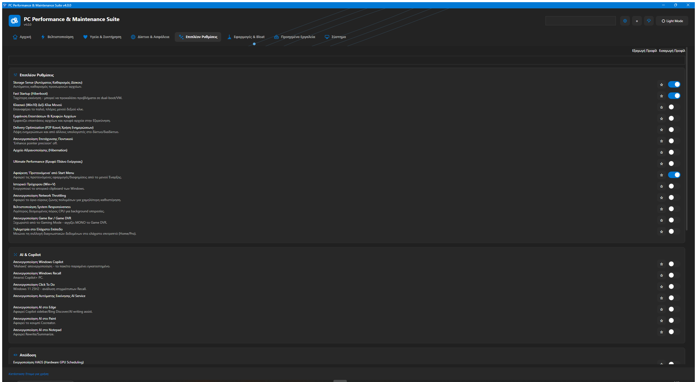
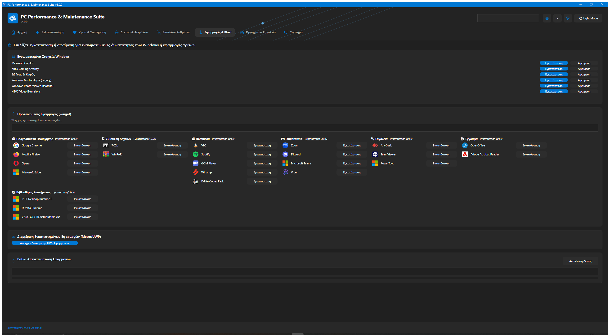
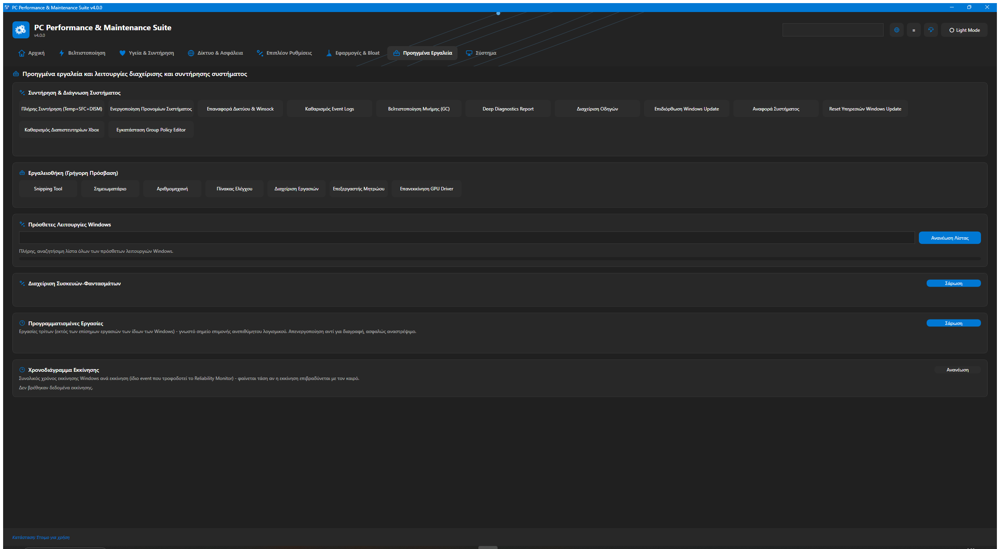
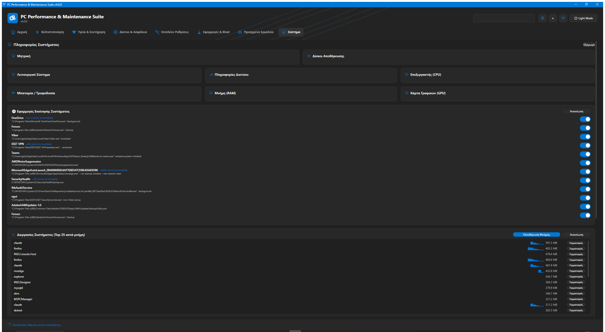

# GearWin — Complete PC Care

Ένα δωρεάν, ανοιχτού κώδικα εργαλείο συντήρησης και βελτιστοποίησης για Windows 11 — μαζεύει σε ένα
μέρος όλα όσα χρειάζεται ένας χρήστης για να κρατήσει τον υπολογιστή του γρήγορο, καθαρό, ασφαλή και
υπό τον δικό του έλεγχο, χωρίς να χρειάζεται δεκάδες ξεχωριστά εργαλεία ή χειροκίνητη επεξεργασία του
μητρώου των Windows.

*A free, open-source maintenance and optimization tool for Windows 11 — see the [English section](#english) below.*

## Περιεχόμενα / Contents

- [Ελληνικά](#ελληνικά)
- [English](#english)
- [Άδεια / License](#άδεια--license)

## Ελληνικά

### Λειτουργίες

Η εφαρμογή είναι οργανωμένη σε 8 καρτέλες:

| Καρτέλα | Τι κάνει |
|---|---|
| 🏠 Αρχική | Βαθμολογία υγείας συστήματος, γρήγορες ενέργειες συντήρησης, κατάσταση σύνδεσης δικτύου με ζωντανό γράφημα ταχύτητας |
| ⚡ Βελτιστοποίηση | Καθαρισμός προσωρινών/άχρηστων αρχείων, διαχείριση εκκίνησης, σχέδια ενέργειας, εργαλεία απόδοσης |
| ❤ Υγεία Συστήματος | Έλεγχος υγείας δίσκων/μνήμης/συστήματος αρχείων, ανάλυση χώρου δίσκου ανά κατηγορία |
| 🌐 Δίκτυο & Ασφάλεια | Διαγνωστικά δικτύου, DNS, Windows Defender, μπλοκάρισμα τηλεμετρίας, εργαλεία απορρήτου |
| 🔧 Επιπλέον Ρυθμίσεις | Δεκάδες tweaks διεπαφής/απόδοσης/απορρήτου, με ασφαλή επαναφορά στην αρχική τιμή |
| 🧹 Αφαίρεση Bloatware | Ασφαλής αφαίρεση προεγκατεστημένων εφαρμογών, με δυνατότητα επαναφοράς |
| 🛠 Προηγμένα Εργαλεία | Συντήρηση συστήματος, προαιρετικές δυνατότητες Windows, custom δεξί-κλικ μενού, ενημερώσεις οδηγών |
| 🖥 Σύστημα | Πλήρης ανάλυση υλικού/λειτουργικού ("Η Συσκευή Μου"), διαχείριση διεργασιών/δίσκων/ενημερώσεων |

Επίσης: πλήρης υποστήριξη 4 γλωσσών (Ελληνικά/Αγγλικά/Γερμανικά/Γαλλικά), θέματα εμφάνισης
Ανοιχτού/Σκούρου φόντου με πολλαπλά κινούμενα στυλ, οδηγός χρήσης στο πρώτο άνοιγμα, και ιστορικό
ενεργειών για πλήρη διαφάνεια στο τι άλλαξε η εφαρμογή στο σύστημα.

### Στιγμιότυπα οθόνης / Screenshots

<table>
<tr>
<td><br/><sub>Αρχική / Home</sub></td>
<td><br/><sub>Βελτιστοποίηση / Optimization</sub></td>
</tr>
<tr>
<td><br/><sub>Υγεία & Συντήρηση / Health & Maintenance</sub></td>
<td><br/><sub>Δίκτυο & Ασφάλεια / Network & Security</sub></td>
</tr>
<tr>
<td><br/><sub>Επιπλέον Ρυθμίσεις / Extra Settings</sub></td>
<td><br/><sub>Εφαρμογές & Bloat / Apps & Bloat</sub></td>
</tr>
<tr>
<td><br/><sub>Προηγμένα Εργαλεία / Advanced Tools</sub></td>
<td><br/><sub>Σύστημα / System</sub></td>
</tr>
</table>

### Εγκατάσταση

Κατεβάστε το τελευταίο `GearWin-Setup-*.exe` από τα [Releases](../../releases) και εκτελέστε το
(απαιτεί δικαιώματα διαχειριστή). Η εφαρμογή τρέχει πάντα ως Administrator, αφού πολλές από τις
λειτουργίες της χρειάζονται πρόσβαση στο μητρώο/σύστημα των Windows.

Για αυτοματοποιημένη/σιωπηλή εγκατάσταση (π.χ. σε scripted deployment), ο installer (Inno Setup)
υποστηρίζει ήδη τα τυπικά flags χωρίς καμία επιπλέον ρύθμιση: `GearWin-Setup-*.exe /VERYSILENT
/SUPPRESSMSGBOXES /NORESTART` (προαιρετικά και `/DIR="C:\path"` για διαφορετικό φάκελο εγκατάστασης).
Χρειάζεται ούτως ή άλλως δικαιώματα διαχειριστή, οπότε τρέξτε το από ένα ήδη-elevated shell/task.

### Χτίσιμο από τον πηγαίο κώδικα

```
dotnet publish wpf/OptimizerWpf -c Release -r win-x64 --self-contained true -p:PublishSingleFile=false -p:IncludeNativeLibrariesForSelfExtract=true -o wpf/OptimizerWpf/publish/win-x64
ISCC.exe installer/OptimizerWpf.iss
```

Το τελικό `GearWin-Setup-<έκδοση>.exe` καταλήγει στο `installer/Output/`.

### Δομή αποθετηρίου

- `wpf/OptimizerWpf/` — η τρέχουσα εφαρμογή (.NET 8, WPF/C#, MVVM-style views ανά καρτέλα)
- `wpf/OptimizerWpf.Tests/` — unit tests (xUnit)
- `Optimizer.ps1` — το αρχικό PowerShell/WinForms εργαλείο (διατηρείται για ιστορικούς λόγους)
- `installer/` — Inno Setup script + άδεια χρήσης/περιγραφή ανά γλώσσα

## English

A free, open-source maintenance and optimization tool for Windows 11, built to bring everything a
user needs to keep their PC fast, clean, secure, and under their own control into one place — no
more hunting through dozens of separate tools or manually editing the Windows registry.

### Features

The app is organized into 8 tabs:

| Tab | What it does |
|---|---|
| 🏠 Home | System health score, quick maintenance actions, network status with a live throughput graph |
| ⚡ Optimization | Temp/junk file cleanup, startup management, power plans, performance tools |
| ❤ System Health | Disk/memory/file-system health checks, disk space analysis by category |
| 🌐 Network & Security | Network diagnostics, DNS, Windows Defender, telemetry blocking, privacy tools |
| 🔧 Tweaks | Dozens of interface/performance/privacy tweaks, safely restorable to their original value |
| 🧹 Bloatware Removal | Safely remove pre-installed apps, with the option to restore them |
| 🛠 Advanced Tools | System maintenance, optional Windows features, custom right-click menus, driver updates |
| 🖥 System | Full hardware/OS breakdown ("My Device"), process/disk/update management |

Also: full support for 4 languages (Greek/English/German/French), Light/Dark appearance themes with
multiple animated styles, a first-run tutorial, and an action log for full transparency on what the
app changed on your system.

### Screenshots

See the [screenshot gallery](#στιγμιότυπα-οθόνης--screenshots) above (all 8 tabs).

### Installation

Download the latest `GearWin-Setup-*.exe` from [Releases](../../releases) and run it (requires
administrator rights). The app always runs as Administrator, since many of its features need access
to the Windows registry/system.

For unattended/scripted installs, the installer (Inno Setup) already supports the standard silent
flags with no extra setup needed: `GearWin-Setup-*.exe /VERYSILENT /SUPPRESSMSGBOXES
/NORESTART` (optionally add `/DIR="C:\path"` for a custom install folder). It still needs
administrator rights either way, so run it from an already-elevated shell/task.

### Building from source

```
dotnet publish wpf/OptimizerWpf -c Release -r win-x64 --self-contained true -p:PublishSingleFile=false -p:IncludeNativeLibrariesForSelfExtract=true -o wpf/OptimizerWpf/publish/win-x64
ISCC.exe installer/OptimizerWpf.iss
```

The final `GearWin-Setup-<version>.exe` lands in `installer/Output/`.

### Repository layout

- `wpf/OptimizerWpf/` — the current app (.NET 8, WPF/C#, one view per tab)
- `wpf/OptimizerWpf.Tests/` — unit tests (xUnit)
- `Optimizer.ps1` — the original PowerShell/WinForms tool (kept for historical reasons)
- `installer/` — Inno Setup script + per-language license/description files

## Άδεια / License

Διανέμεται δωρεάν υπό την [MIT License](installer/license_en.txt). Ορισμένες ιδέες σχεδίασης
εμπνεύστηκαν από το ανοιχτού κώδικα εργαλείο
[Windows Maintenance Tool](https://github.com/ios12checker/Windows-Maintenance-Tool), επίσης υπό
άδεια MIT.

*Distributed for free under the [MIT License](installer/license_en.txt). Some design ideas were
inspired by the open-source [Windows Maintenance Tool](https://github.com/ios12checker/Windows-Maintenance-Tool),
also MIT-licensed.*

**Το λογισμικό παρέχεται "ΩΣ ΕΧΕΙ", χωρίς καμία εγγύηση. / Provided "AS IS", without warranty of any kind.**
